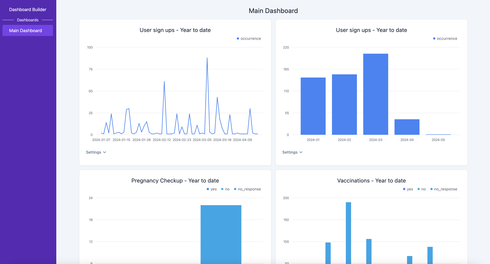

# HERA Monitoring & Evaluation Dashboard



## Local development

This is a Vite SPA so development is really easy. All you need to do is:

1. `yarn install`
2. `yarn dev`

## Deploying to production

1. Run `yarn build` locally
2. Tar the dist directory: `tar -czvf dist.tar.gz dist/`
3. scp dist.tar.gz to the EC2 instance

Now ssh into the EC2 instance as a root user

1. Untar into `/srv/data-dashboard`
2. Run `pm2 list` and check if `vite-app` is already there
3. Untar the
4. Run `pm2 list` and check if `vite-app` is already there.
5. If it is, just run `pm2 restart vite-app`. If it is not, run `pm2 serve /srv/data-dashboard 3000 --spa --name vite-app` to start the service.

The dashboard should be running and accessible at the EC2 instance URL!

Once the app is running in production, starting/stopping can be handled easily using `pm2`. Just use `pm2 stop vite-app` or `pm2 restart vite-app` as necessary.

To view logs, use `pm2 logs`

## How do I add a new dashboard?

1. Go to the Dashboard Builder
2. Build your dashboard
3. Click on "Export Dashboard"
4. Save the JSON file in `src/dashboards` (name the JSON file however you'd like)
5. Import the JSON in `src/config/Dashboards.ts` and add it to the `DASHBOARDS` array in that file

## How do I add new indicators?

Add any new indicator configurations to `src/config/Indicators.ts`

A new indicator requires a name and the endpoint it will hit at the Django backend API: `https://herav2-web-service.production-turkey.herav2.heradigitalhealth.com/data_dashboard/`

The endpoint you list will be appended after the `/data_dashboard/` path.

## To do

- [ ] Store and load dashboards in a database instead of hardcoding JSONs
- [ ] Manage dashboards via CRUD API endpoints in the Django backend
- [ ] Add scripts to upgrade/downgrade dashboards when their schema changes
- [ ] Deploy to production and add documentation to Readme on how to deploy
- [ ] In DashboardViewer mode, show an error if a visualization tries to load without a valid QuerySpec
- [ ] Check for dashboard slug uniqueness before saving
- [ ] Redirect users to `/login` if they are not authenticated

## Stack

- [React](https://legacy.reactjs.org/) with [Vite](https://vitejs.dev/) to bundle as a single-page app (SPA).
- [Tremor](https://www.tremor.so/) for UI and visualizations. It is easy to use, looks beautiful out-of-the-box, and is built on top of Tailwind CSS. If more complex visualizations with more customizability are needed then we should consider moving to a more advanced charting library, like [Recharts](https://recharts.org/en-US) or [react-chartjs-2](https://react-chartjs-2.js.org/).
- [TailwindCSS](https://tailwindcss.com/) for CSS.
- [Prettier](https://prettier.io/) and [eslint](https://eslint.org/) for code style and formatting.
- [Remedda](https://remedajs.com/) for general utilities
- [React Query](https://tanstack.com/query/latest) for asynchronous state management.
- [React Router](https://reactrouter.com/en/main) for routing

## Code Architecture

The app is structured as a single-page app with three main views:

1. Login view
2. Dashboard Builder view
3. Dashboard Viewer view

### Login view

**Directory**: `/src/components/LoginView`

Handles authentiation by generating a CSRF token with the Django backend API and using that for subsequent calls. If authentication is successful, the user will be redirected to the main app.

### Dashboard Builder view

**Directory**: `/src/components/DashboardBuilderView`

This is where you can build new visualizations, explore your data, arrange them into a dashboard, and export a dashboard JSON.

### Dashboard Viewer view

**Directory**: `/src/components/DashboardViewerView`

This is where you can view a pre-built dashboard. Pre-built dashboards are representd by a `DashboardSpec` model which is stored in a JSON blob. Currently, dashboard JSONs are stored in `src/dashboards` though eventually they should be stored in a database to prevent needing to bundle them with the app.

### Overall directory structure

```
.
└─ src
    ├── main.tsx # App entry point
    ├── assets
    │   └── Publicly reachable assets
    ├── components
    │   ├── DashboardBuilderView
    │   ├── DashboardViewer
    │   ├── LoginView
    │   └── ui
    │       └── Custom-built UI components and visualizations
    ├── config
    │   └── Configuration files
    ├── dashboards
    │   └── Pre-built dashboards to load into the app
    ├── hooks
    │   └── Commonly used hooks
    ├── models
    │   └── Common data models and types used throughout the app
    └── utils
        └── Common utility functions
```

### VizSpec and DashboardSpec

These are the two most important models (i.e. types) of the app.

`VizSpec` is the model that represents how a visualization is both queried and rendered. Inside `VizSpec` there is a `querySpec` nested model. This holds the specification of how we should query the backend API. Everything else that isn't `querySpec` refers to how the visualization should be rendered on the frontend (for example, which visualization type we're choosing or which field is our x-axis).

`DashboardSpec` is the model that represents how a dashboard is configured. It consists mostly of a title, a slug (i.e. the URL-friendly title that the dashboard will be accessible at), and a list of visualizations (represented as an array of `VizSpec` models).
